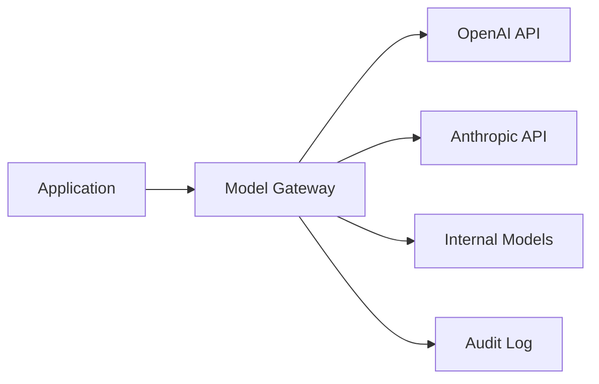

# AI Engineering Standards

This document defines the standards for designing, building, integrating, and operating AI systems at EdenCORP. All teams building AI-powered features or products must comply with these standards.

---

## Model Integration Guidelines

### Approved Integration Patterns

AI models must be accessed through the **EdenCORP Model Gateway** — a centralised proxy layer that enforces authentication, rate limiting, logging, and policy controls.

Direct integration from application code to third-party model APIs (OpenAI, Anthropic, etc.) is not permitted in production systems.



### Model Selection Criteria

Before selecting a model for a use case, evaluate:

- **Capability fit:** Does the model reliably perform the required task?
- **Latency requirements:** Does the model meet the latency budget for the use case?
- **Cost:** Is the token cost acceptable at expected scale?
- **Privacy:** Does the use case involve data that cannot leave the EdenCORP infrastructure boundary?
- **Compliance:** Does the model provider's data processing agreement meet our requirements?

---

## Prompt Engineering Standards

### Structure

Every prompt used in production must follow the structured template:

```
[SYSTEM CONTEXT]
Define the model's role, constraints, and output format.

[BACKGROUND CONTEXT]
Relevant retrieved context, documents, or data (for RAG systems).

[USER INPUT]
The actual user request or task.

[OUTPUT INSTRUCTIONS]
Explicit instructions for response format, length, and tone.
```

### Requirements

- All prompts must be stored as versioned templates — not hardcoded inline strings.
- Prompt templates are stored in the `prompts/` directory of the relevant service.
- Every template has a unique ID, version, and owner.
- Changes to prompts in production require the same review process as code changes.
- Prompt templates must include explicit instructions for handling edge cases and refusal scenarios.
- System prompts must not be exposed to users and must be treated as confidential configuration.

### Injection Prevention

- All user-supplied content inserted into prompts must be clearly delimited to prevent prompt injection.
- Use XML-style tags or triple-backtick delimiters to separate user content from instructions.
- Validate and sanitise user inputs before inclusion in prompts.

```typescript
// Example safe prompt construction
const prompt = `
<user_input>
${sanitiseForPrompt(userContent)}
</user_input>

Based only on the content within <user_input> tags above, provide...
`;
```

---

## Context Management Rules

- **Context window budgeting:** Allocate context space explicitly: system prompt, retrieved context, conversation history, and response buffer. Do not rely on implicit truncation.
- **Conversation history:** Store and retrieve conversation history from persistent storage, not in-memory. Summarise older turns when approaching context limits.
- **RAG context:** Retrieved documents must be ranked by relevance and trimmed to fit the context budget. Include provenance metadata (source, date) alongside retrieved chunks.
- **Context expiry:** Conversation contexts expire after 24 hours of inactivity by default. Document any exceptions.

---

## Data Privacy Constraints

- **PII in prompts:** Personally Identifiable Information must not be sent to third-party model APIs unless explicitly permitted by the data processing agreement and the user's consent terms.
- **Data minimisation:** Include only the data required for the task. Strip or pseudonymise PII before sending to external models.
- **Data residency:** For use cases with data residency requirements, use models and infrastructure that satisfy those requirements (self-hosted or region-specific APIs).
- **Training data opt-out:** EdenCORP data must be opted out of model provider training programmes where this option is available.
- **Audit trail:** All prompts and model responses must be logged for audit purposes (see Observability section). Logs are retained per the data retention policy.

---

## Evaluation Pipelines

All AI features must have a defined evaluation pipeline before reaching production.

### Evaluation Dimensions

| Dimension | What to measure |
|---|---|
| Correctness | Does the model produce the right answer for known-good test cases? |
| Consistency | Does the model produce consistent outputs for semantically equivalent inputs? |
| Refusal accuracy | Does the model correctly refuse out-of-scope or harmful requests? |
| Latency | Does the model meet the latency budget at the required percentile? |
| Cost | What is the token cost per operation at expected scale? |
| Regression | Does a model or prompt change cause degradation on previously passing cases? |

### Process

1. Define an **evaluation dataset** of golden examples before writing prompts.
2. Run the evaluation pipeline in CI on every prompt template change.
3. Track metrics over time in the AI observability dashboard.
4. A change that causes > 5% regression on any evaluation dimension blocks merge.
5. Manual human evaluation is required for features that involve subjective quality dimensions (tone, creativity, empathy).

---

## Model Versioning Rules

- Every production model integration must pin to a **specific model version** (e.g., `gpt-4o-2024-05-13`, not `gpt-4o`).
- Model version upgrades are treated as code changes and require:
  - Evaluation pipeline run against the new model version.
  - A/B testing or shadow mode deployment to compare outputs.
  - Sign-off from the feature owner.
- The model version, prompt template version, and configuration hash are logged with every inference call.
- Model version changes are documented in the changelog of the relevant service.

---

## Guardrails and Hallucination Mitigation

### Required Guardrails

Every AI feature must implement appropriate guardrails from this list:

| Guardrail | Applicable scenarios |
|---|---|
| Output format validation | JSON/structured output — validate schema before use |
| Confidence thresholds | Classification tasks — reject low-confidence outputs |
| Factual grounding check | RAG systems — verify claims against source documents |
| Content policy filter | Any user-facing output — block harmful content |
| Scope enforcement | Task-specific assistants — detect and refuse off-topic requests |
| Rate limiting | All user-facing AI endpoints |

### Hallucination Mitigation Techniques

- **Retrieval-Augmented Generation (RAG):** Ground model outputs in retrieved, authoritative documents.
- **Chain-of-thought prompting:** Require the model to show its reasoning before producing a final answer.
- **Self-consistency:** For high-stakes decisions, sample multiple responses and use majority voting or a verification step.
- **Citation requirements:** Instruct the model to cite its sources. Verify citations programmatically where possible.
- **Structured output:** Request JSON or structured responses and validate the schema. Unstructured responses are harder to validate and audit.

---

## Human-in-the-Loop Review Expectations

The following scenarios require human review before acting on AI output:

| Scenario | Requirement |
|---|---|
| Legal or compliance decisions | Human must review and approve before action |
| Medical or health information | Human must review before delivery to end user |
| Financial transactions > threshold | Configurable threshold; human approval required |
| Content moderation (appeals) | Human review within SLA |
| AI-generated code deployed to production | Engineering review in PR process |
| Automated communications to external parties | Human approval for non-templated content |

Human-in-the-loop workflows must be implemented as explicit review queues — not as optional review steps that can be bypassed.

---

## Observability for AI Systems

### Required Metrics

All AI features must emit the following metrics to the centralised observability platform:

| Metric | Description |
|---|---|
| `ai.request.count` | Total inference requests |
| `ai.request.latency_ms` | End-to-end latency per request |
| `ai.token.input` | Input tokens consumed per request |
| `ai.token.output` | Output tokens generated per request |
| `ai.token.cost_usd` | Estimated cost per request |
| `ai.guardrail.triggered` | Count of guardrail activations by type |
| `ai.error.count` | Failed requests by error type |
| `ai.eval.score` | Evaluation metric scores (reported from evaluation pipeline) |

### Required Traces

- Trace every request through the full AI pipeline: input handler → context builder → prompt orchestrator → model gateway → guardrail layer → output handler.
- Attach `requestId`, `userId`, `modelId`, `promptTemplateId`, and `promptTemplateVersion` to every trace.
- Traces are retained for 30 days minimum.

### Alerting

- Alert when `ai.error.count` exceeds 1% of `ai.request.count` over a 5-minute window.
- Alert when `ai.request.latency_ms` (p99) exceeds the defined latency budget for > 2 minutes.
- Alert when `ai.guardrail.triggered` spikes unexpectedly (> 2× baseline over 15 minutes).

---

## Responsible AI Principles

EdenCORP is committed to building AI systems that are safe, fair, and transparent. All AI features must be assessed against these principles before launch:

### Fairness
- Evaluate outputs for demographic bias using representative test datasets.
- Document known limitations and biases in the feature's technical specification.
- Do not deploy systems where known bias could cause material harm to users.

### Transparency
- Users interacting with AI-generated content must be informed that the content is AI-generated.
- Automated decisions that materially affect users must be explainable on request.
- Maintain records of AI system behaviour sufficient to reconstruct decisions.

### Safety
- Implement content filters to prevent generation of harmful, illegal, or abusive content.
- Test adversarial inputs (jailbreaks, prompt injection, edge cases) before launch.
- Define and document the safe failure mode for every AI feature.

### Privacy
- Apply data minimisation at every stage of the AI pipeline.
- Users have the right to request deletion of their data from AI system logs and training datasets where applicable.

### Accountability
- Every AI feature has a named technical owner.
- AI incidents (hallucinations, bias events, safety failures) are tracked in the incident management system.
- Quarterly responsible AI reviews are conducted by `@EdenCorporations/platform` for all production AI features.
