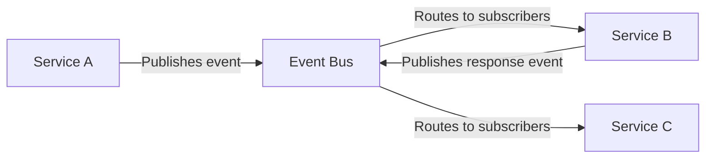
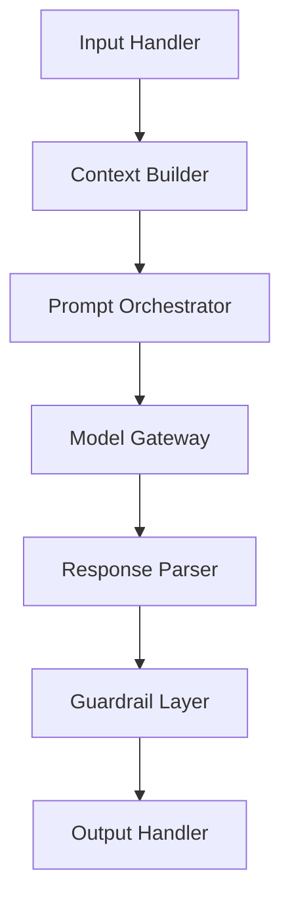

# Architecture Standards

This document defines the architectural principles, patterns, and constraints that govern all EdenCORP systems. Every service, API, and platform component must be designed in alignment with these standards.

---

## Monorepo vs Polyrepo

EdenCORP uses a **polyrepo strategy** with shared standards enforced at the organisation level.

| Consideration | Decision |
|---|---|
| Product isolation | Each product or major service has its own repository |
| Shared libraries | Published as versioned internal packages via private registry |
| Standards enforcement | Centralised via `eden-standards` and organisation-level CI templates |
| Cross-team coordination | Managed through explicit API contracts and versioned SDKs |

**When to consider a monorepo:** Tightly coupled services that are always deployed together, share a build graph, and are owned by a single team may use a monorepo. This requires explicit approval via ADR.

---

## Service-Oriented Architecture

EdenCORP systems are built as independently deployable services with clearly defined boundaries.

### Principles

- Services own their data. No shared databases between services.
- Services communicate through stable, versioned interfaces (REST, GraphQL, or message queues).
- Each service is independently deployable without coordinating releases with other services.
- Services must fail gracefully. No cascading failures.
- Services expose health and readiness endpoints for orchestration.

### Service Boundary Checklist

Before creating a new service, validate:

- [ ] The service has a single, clearly defined responsibility.
- [ ] The service owns all the data it needs to fulfil its responsibility.
- [ ] The interface contract is defined before implementation begins.
- [ ] The service can be deployed, scaled, and replaced independently.

---

## API Design Standards

### REST APIs

- Follow [RFC 7231](https://datatracker.ietf.org/doc/html/rfc7231) HTTP semantics.
- Use **noun-based resource paths**: `/users/{id}`, not `/getUser`.
- Use appropriate HTTP methods: `GET` (read), `POST` (create), `PUT`/`PATCH` (update), `DELETE` (remove).
- Use **HTTP status codes correctly**: `200 OK`, `201 Created`, `400 Bad Request`, `401 Unauthorized`, `403 Forbidden`, `404 Not Found`, `422 Unprocessable Entity`, `500 Internal Server Error`.
- All APIs must return JSON with `Content-Type: application/json`.
- Paginate all list endpoints using cursor-based pagination.
- Version APIs in the URL path: `/v1/users`, `/v2/users`.
- Never remove a version without a deprecation period of at least 90 days.

**Response envelope:**
```json
{
  "data": {},
  "meta": {
    "requestId": "uuid",
    "timestamp": "ISO8601"
  },
  "error": null
}
```

**Error response:**
```json
{
  "data": null,
  "meta": {
    "requestId": "uuid",
    "timestamp": "ISO8601"
  },
  "error": {
    "code": "VALIDATION_ERROR",
    "message": "Human-readable message",
    "details": []
  }
}
```

### GraphQL APIs

- GraphQL is permitted for internal BFF (Backend for Frontend) layers only.
- Public APIs must be REST.
- Use query depth limiting and complexity scoring to prevent abuse.
- All mutations must be idempotent where possible.
- Schema changes must be backward-compatible. New fields are additive. Deprecated fields are marked `@deprecated` before removal.

---

## Serverless Principles

Serverless functions (AWS Lambda, Vercel functions, etc.) are appropriate for:

- Event-driven processing with variable load.
- Lightweight API handlers.
- Scheduled jobs and data pipeline steps.

Serverless functions must:

- Complete within defined timeout budgets (default: 30 seconds; document any exception).
- Be stateless. No local file system state or in-memory caches that persist across invocations.
- Handle cold starts gracefully. Avoid blocking on cold-start-sensitive operations.
- Follow the same observability requirements as long-running services.

**Not appropriate for:** Long-running processes, stateful orchestration, WebSocket connections (use dedicated infrastructure instead).

---

## Microservice Boundaries

Services are grouped into domains. Domain ownership determines who is consulted for cross-cutting changes.

```
Domain: Identity
  - auth-service
  - user-service

Domain: AI Platform
  - model-gateway
  - prompt-orchestrator
  - evaluation-service

Domain: Product
  - (product-specific services)

Domain: Platform
  - notification-service
  - audit-service
  - observability-pipeline
```

Communication between domains must go through the defined API interface of the target domain. Direct database access across domain boundaries is prohibited.

---

## Domain-Driven Design

- Each service maps to a **bounded context** with explicit language (ubiquitous language) shared within that context.
- **Aggregates** define consistency boundaries. Events are emitted at aggregate boundaries.
- **Domain events** are the primary mechanism for cross-service communication in asynchronous flows.
- **Anti-corruption layers** must be implemented when integrating with external systems to prevent external models from polluting internal domain models.

---

## Event-Driven Architecture



### Event Standards

- Events are **immutable facts** about something that has already happened. Name them in past tense: `user.created`, `payment.processed`, `model.evaluated`.
- Events must include: `eventId`, `eventType`, `aggregateId`, `aggregateType`, `timestamp`, `version`, `payload`.
- Consumers must be **idempotent**. The same event may be delivered more than once.
- Dead-letter queues are required for all event consumers.
- Event schemas are versioned and managed in a schema registry.

---

## Scalability Expectations

| Tier | Target Throughput | Latency (p99) | Availability |
|---|---|---|---|
| Public API | 1,000 req/s per service | < 500ms | 99.9% |
| Internal API | 5,000 req/s per service | < 200ms | 99.5% |
| AI Inference | 100 req/s per model | < 2,000ms | 99.5% |
| Background jobs | Varies by workload | Best-effort | 99.0% |

Systems must be load tested to at least **2× expected peak** before reaching production.

---

## Performance Baselines

- **Web pages (Core Web Vitals):** LCP < 2.5s, FID < 100ms, CLS < 0.1.
- **API responses:** p50 < 100ms, p95 < 300ms, p99 < 500ms for standard CRUD operations.
- **Database queries:** No query should exceed 1 second without explicit justification and caching strategy.
- **Cold start (serverless):** < 1 second for functions on critical paths.

Performance budgets are enforced in CI for front-end builds (Lighthouse CI) and via synthetic monitoring for APIs.

---

## AI System Modularity

AI systems must follow a **modular pipeline architecture**:



Each stage is independently replaceable. Swapping the underlying model must not require changes to the input handler or output handler.

See [AI_ENGINEERING.md](AI_ENGINEERING.md) for full AI system standards.

---

## Architecture Decision Records

All significant architectural decisions must be documented using the [ADR template](templates/architecture_decision_record.md). ADRs are stored in the `docs/adr/` directory of the relevant repository.

See [DOCUMENTATION.md](DOCUMENTATION.md) for ADR policy.
