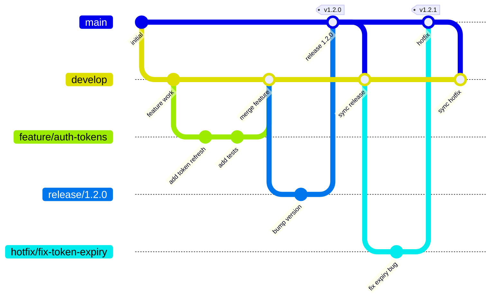

# Branching Strategy

EdenCORP uses a **GitFlow-lite** model — structured enough for release management and hot-fix handling, lightweight enough not to slow teams down.

---

## Branch Model Overview

---

## Permanent Branches

| Branch | Purpose | Who merges to it |
|---|---|---|
| `main` | Production-ready code. Always deployable. | `@EdenCorporations/platform` via release or hotfix PR |
| `develop` | Integration branch. Merged features awaiting release. | Engineers via feature PR |

Direct commits to `main` or `develop` are not permitted. All changes go through pull requests.

---

## Branch Naming Format

| Branch type | Format | Example |
|---|---|---|
| Feature | `feature/<ticket-id>-short-description` | `feature/ENG-142-user-auth-tokens` |
| Bug fix | `fix/<ticket-id>-short-description` | `fix/ENG-198-token-expiry-off-by-one` |
| Release | `release/<version>` | `release/1.2.0` |
| Hotfix | `hotfix/<ticket-id>-short-description` | `hotfix/ENG-201-critical-token-bypass` |
| Chore | `chore/<short-description>` | `chore/update-dependencies` |
| Docs | `docs/<short-description>` | `docs/update-api-reference` |
| Experiment | `experiment/<short-description>` | `experiment/llm-streaming-prototype` |

Rules:
- Use lowercase and hyphens only. No underscores or spaces.
- Keep descriptions concise (≤ 5 words).
- Always include the ticket ID for feature and fix branches.

---

## Main Branch Protection Rules

The following rules are enforced on `main` via GitHub branch protection:

- **Require pull request before merging.** No direct pushes.
- **Require at least 1 approving review.** Changes to security, AI, or architecture standards require 2 approvals.
- **Require status checks to pass before merging.** All CI checks must be green.
- **Require branches to be up to date before merging.** PRs must be rebased or merged from `main` before approval.
- **Require linear history.** Squash merges only (no merge commits on `main`).
- **Restrict who can push.** Only `@EdenCorporations/platform` can merge to `main`.
- **Do not allow force pushes.**
- **Do not allow branch deletions.**

The same rules (minus the restriction on who can merge) apply to `develop`.

---

## PR Requirements

Every pull request must:

- Use the [PR template](templates/pull_request_template.md).
- Be linked to a Jira ticket or GitHub issue.
- Pass all required CI checks.
- Have a descriptive title following the Conventional Commits format (e.g., `feat(auth): add refresh token rotation`).
- Be reviewed and approved before merge.
- Have no unresolved review comments at merge time.

---

## Release Flow

1. When `develop` is ready for a release, create a release branch: `release/<version>` (e.g., `release/1.3.0`).
2. On the release branch, perform only:
   - Version bumps (`package.json`, `CHANGELOG.md`).
   - Release-critical bug fixes (documented in CHANGELOG).
3. Open a PR from `release/<version>` to `main`.
4. After review and approval, merge to `main`.
5. Tag `main` with the release version: `v1.3.0`.
6. Open a PR to merge `main` back into `develop` to capture any release branch commits.

See [VERSIONING.md](VERSIONING.md) for tagging and changelog requirements.

---

## Hotfix Handling

Hotfixes address critical production issues that cannot wait for the next regular release.

1. Branch from `main`: `hotfix/<ticket-id>-short-description`.
2. Fix the issue and write a regression test.
3. Open a PR to `main`. Mark it with the `hotfix` label.
4. Hotfix PRs require:
   - At least 1 approval from `@EdenCorporations/platform`.
   - All CI checks passing.
5. Merge to `main`. Tag with the patch version: `v1.2.1`.
6. Open a PR to merge `main` back into `develop`.

Hotfixes must **never** introduce new features or unrelated changes.

---

## Tagging Conventions

- All production releases are tagged on `main` using annotated tags.
- Tag format: `v<major>.<minor>.<patch>` (e.g., `v2.1.0`).
- Pre-release tags: `v2.1.0-beta.1`, `v2.1.0-rc.1`.
- Tags are created by `@EdenCorporations/platform` after a successful production deployment.
- Every tag must have a corresponding entry in `CHANGELOG.md`.

---

## Stale Branch Policy

- Feature and fix branches that have not received a commit in 30 days are automatically flagged by CI.
- Flagged branches are deleted after an additional 7-day grace period unless the owner requests an extension.
- Experiment branches are deleted after 14 days of inactivity.
