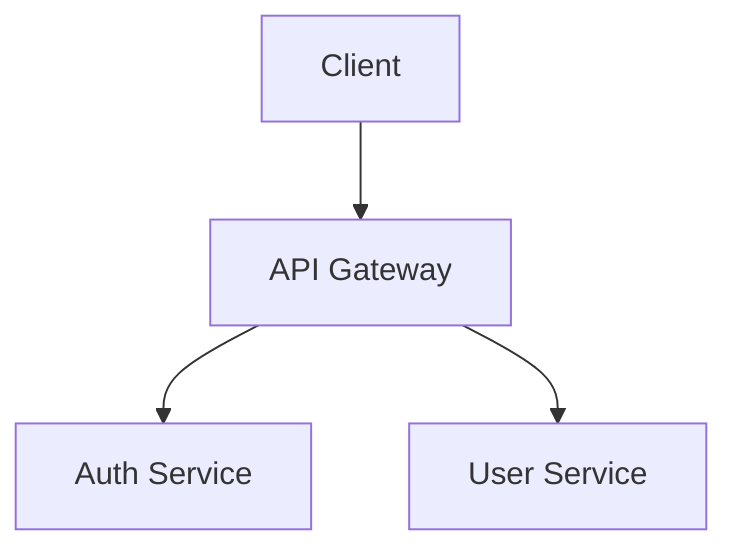

# Documentation Standards

This document defines EdenCORP's documentation requirements for all repositories and services. Good documentation is not optional — it is a deliverable.

---

## Required Documentation for Every Repository

Every EdenCORP repository must contain the following at minimum:

| File | Purpose |
|---|---|
| `README.md` | Project overview, setup instructions, and links to further documentation |
| `CHANGELOG.md` | Version history (see [VERSIONING.md](VERSIONING.md)) |
| `.env.example` | All environment variables with descriptions and example values |
| `docs/adr/` | Architecture Decision Records directory |

The `README.md` must include:

- **What this is:** One paragraph describing the project.
- **Who owns it:** The owning team and primary contact.
- **How to set it up:** Step-by-step local development setup.
- **How to run tests:** Exact command to run the test suite.
- **How to deploy:** Link to deployment runbook or CI/CD description.
- **Key dependencies and their purpose.**
- **Link to API documentation** (if applicable).
- **Link to architecture diagram or ADRs** (if applicable).

---

## API Documentation Rules

### OpenAPI / Swagger

All REST APIs must be documented using [OpenAPI 3.1](https://spec.openapis.org/oas/v3.1.0).

- The OpenAPI spec is the source of truth. It is generated from code annotations (e.g., `fastify-swagger`, `tsoa`) — not written by hand.
- The spec is published to the internal developer portal automatically on every release.
- Every endpoint must document: description, parameters (with types and constraints), request body schema, all possible response codes and schemas.
- Authentication requirements must be documented for every endpoint.

### GraphQL

- GraphQL schemas must include descriptions on all types and fields.
- Auto-generated schema documentation is published to the internal developer portal.

### Inline Code Documentation

- All exported functions, classes, and types must have JSDoc comments.
- Internal helper functions do not require JSDoc unless the logic is non-obvious.
- JSDoc must include: `@param`, `@returns`, and `@throws` where applicable.

```typescript
/**
 * Retrieves a user by their unique identifier.
 *
 * @param id - The user's UUID.
 * @returns The user record, or null if no user exists with the given ID.
 * @throws {DatabaseError} If the database query fails.
 */
export async function getUserById(id: string): Promise<User | null> {
  // ...
}
```

---

## Architecture Decision Records (ADR) Policy

An Architecture Decision Record captures the context, decision, and consequences of a significant architectural choice. ADRs create a permanent, searchable record of *why* the system is designed the way it is.

### When to write an ADR

Write an ADR when the decision:

- Affects the system's architecture, technology stack, or data model.
- Has long-term implications that are difficult to reverse.
- Was non-obvious or was the result of evaluating multiple alternatives.
- Will affect multiple teams or repositories.

When in doubt, write the ADR. Over-documentation is far less costly than undocumented decisions.

### ADR Process

1. Create a new file: `docs/adr/ADR-<NNN>-short-title.md` (e.g., `ADR-001-use-postgresql-for-primary-database.md`).
2. Use the [ADR template](templates/architecture_decision_record.md).
3. Submit the ADR as a PR. The ADR is discussed in the PR review.
4. Approved ADRs are merged as `Accepted`. Rejected alternatives remain with status `Rejected` for record.
5. If a decision is later superseded, update the original ADR status to `Superseded by ADR-XXX` and create a new ADR for the new decision.

### ADR Status Values

| Status | Meaning |
|---|---|
| `Draft` | Under discussion, not yet decided |
| `Accepted` | Decision made and in effect |
| `Rejected` | Considered but not adopted |
| `Deprecated` | Was accepted but is no longer applicable |
| `Superseded` | Replaced by a newer ADR |

---

## Markdown Formatting Standards

All documentation is written in Markdown. Follow these conventions for consistency:

- **Headings:** Use ATX style (`#`, `##`, `###`). Do not skip heading levels.
- **Lists:** Use `-` for unordered lists. Use `1.` for ordered lists. Indent nested lists with 2 spaces.
- **Code blocks:** Always specify the language for syntax highlighting (` ```typescript `, ` ```bash `, etc.).
- **Tables:** Use standard Markdown tables. Align columns for readability in source.
- **Links:** Use descriptive link text. Avoid "click here" or bare URLs in prose.
- **Line length:** Wrap prose at 120 characters. Code examples and tables may exceed this.
- **Emphasis:** Use `**bold**` for key terms and UI labels. Use `*italic*` for titles and light emphasis. Avoid overuse.
- **File names and code in prose:** Use backtick code spans: `README.md`, `getUserById()`.

### Mermaid Diagrams

Use Mermaid for architecture diagrams, flow charts, and sequence diagrams. Prefer Mermaid over static images because Mermaid diagrams are version-controlled and diff-friendly.

````markdown

````

---

## Public vs Internal Documentation

| Type | Location | Access |
|---|---|---|
| Public product documentation | `docs.edencorp.ai` | Public |
| Internal API documentation | Internal developer portal | EdenCORP engineers |
| Architecture decision records | Repository `docs/adr/` | EdenCORP engineers |
| Runbooks and operational docs | Internal wiki | EdenCORP engineers |
| Standards (this repo) | `eden-standards` repository | EdenCORP engineers |

Never publish internal documentation to a public location without explicit approval from `@edencorp/leadership`.

---

## Documentation Reviews

- Documentation changes are reviewed as part of the normal PR process.
- Reviewers are expected to check documentation for accuracy, clarity, and completeness — not just code.
- Outdated documentation that is discovered during a review must be flagged and updated before the PR is merged (or a follow-up ticket created for substantial documentation work).
- Quarterly documentation audits are conducted by `@edencorp/platform` to identify and remove stale content.
