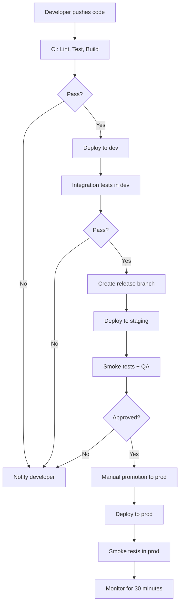

# Infrastructure Standards

This document defines EdenCORP's infrastructure principles, deployment standards, and operational requirements for all environments.

---

## Cloud Provider Principles

EdenCORP uses **AWS as the primary cloud provider**. Alternative providers require explicit approval via ADR.

### General Principles

- **Infrastructure is code.** No manual changes to production infrastructure. Every change is codified, reviewed, and applied via CI/CD.
- **Principle of least privilege.** Every resource, role, and service account has only the permissions required for its function.
- **Immutable infrastructure.** Servers and containers are replaced, not modified in place.
- **Multi-region awareness.** Critical systems are designed to survive single-region failure.
- **Cost visibility.** All infrastructure resources are tagged for cost allocation. Budget alerts are configured for every environment.

### Resource Tagging

Every cloud resource must be tagged with:

| Tag | Value |
|---|---|
| `env` | `dev`, `staging`, or `prod` |
| `team` | Owning team name |
| `service` | Service name |
| `managed-by` | `terraform` (or the IaC tool used) |

---

## Infrastructure as Code

All infrastructure is defined using **Terraform** (or OpenTofu for open-source contexts).

### Requirements

- All Terraform code is stored in the `infrastructure/` directory of the relevant repository, or in a dedicated infrastructure repository.
- Remote state is stored in S3 with DynamoDB state locking. State files are encrypted at rest.
- Terraform workspaces are used to manage environment-specific state.
- All modules are versioned. Pin module versions in all root configurations.
- `terraform plan` output must be reviewed and approved in the PR before `terraform apply` runs.
- `terraform apply` in production is gated behind a manual approval step in CI.

### Module Structure

```
infrastructure/
  modules/
    vpc/
    ecs-service/
    rds/
    s3/
    ...
  environments/
    dev/
      main.tf
      variables.tf
      outputs.tf
    staging/
      ...
    prod/
      ...
  .terraform-version
```

### Policy Enforcement

- **Checkov** or **tfsec** runs in CI to catch common misconfigurations (public S3 buckets, unencrypted storage, overly permissive IAM).
- Any policy violation blocks merge to `main`.

---

## Environment Separation

EdenCORP operates three environments. Each is fully isolated with no shared resources.

| Environment | Purpose | Deployment trigger | Approval required |
|---|---|---|---|
| `dev` | Active development and feature testing | Automated on merge to `main` | None |
| `staging` | Pre-production validation and QA | Automated on release branch creation | None |
| `prod` | Live production systems | Manual promotion from staging | Required (see below) |

### Environment Isolation Rules

- Separate AWS accounts per environment.
- No cross-environment network access.
- Production credentials are never used in dev or staging environments.
- Data from production must be anonymised before use in dev or staging.

---

## Secrets Management

- All secrets are stored in **AWS Secrets Manager** (production) or AWS Parameter Store (non-sensitive config).
- Applications retrieve secrets at runtime using the AWS SDK. Secrets are never passed as environment variables in CI/CD definitions.
- Secrets are rotated automatically where the rotation function is available (RDS credentials, API keys where the provider supports it).
- Manual secrets rotation is performed at least quarterly.
- Access to secrets is logged via CloudTrail and reviewed monthly.

---

## CI/CD Deployment Flow



### CI Requirements Before Deploy

- All tests pass.
- Linting and formatting checks pass.
- Security scanning passes (no new critical CVEs).
- Docker image built and scanned for vulnerabilities.
- Terraform plan reviewed and approved (for infrastructure changes).

### Deployment Strategy

- **Standard services:** Rolling deployment with health check gating.
- **High-traffic services:** Blue/green deployment.
- **Database migrations:** Run before the new application version is deployed. Migrations must be backward-compatible with the previous application version.

---

## Monitoring and Alerting

### Required Monitoring Stack

| Tool | Purpose |
|---|---|
| CloudWatch | AWS metrics and logs |
| Grafana | Dashboards and visualisation |
| Prometheus | Application metrics |
| PagerDuty | On-call alerting |
| Sentry | Application error tracking |

### Baseline Alerts

Every production service must have alerts configured for:

- **Error rate:** Alert if error rate > 1% over 5 minutes.
- **Latency:** Alert if p99 latency exceeds the defined SLA for > 2 minutes.
- **Availability:** Alert if health check fails for > 1 minute.
- **Saturation:** Alert if CPU > 80% or memory > 85% for > 5 minutes.
- **Queue depth:** Alert if message queue depth exceeds the defined threshold.

Alerts route to PagerDuty. On-call rotation is maintained by each service team.

---

## Backup Strategy

| Data type | Backup frequency | Retention | Recovery target |
|---|---|---|---|
| RDS databases | Daily automated snapshot + continuous WAL | 30 days | RPO: 1 hour; RTO: 4 hours |
| S3 data | Versioning + cross-region replication | 90 days | RPO: 0; RTO: 1 hour |
| DynamoDB | Point-in-time recovery enabled | 35 days | RPO: 5 minutes; RTO: 2 hours |
| Application logs | CloudWatch Logs + S3 export | 1 year | N/A |

Backup restoration must be tested quarterly. Results are documented in the incident response log.

---

## Uptime and SLA Targets

| Service tier | Uptime target | Allowed downtime (monthly) |
|---|---|---|
| Tier 1 (customer-facing, revenue-critical) | 99.9% | 43.8 minutes |
| Tier 2 (internal tools, non-critical APIs) | 99.5% | 3.6 hours |
| Tier 3 (dev/staging, background jobs) | 99.0% | 7.3 hours |

Service tier classification is assigned by `@edencorp/leadership` and reviewed annually.

---

## Rollback Strategy

- Every deployment must be reversible within 15 minutes.
- Container-based services: rollback by redeploying the previous image tag. The previous 3 image versions are always retained.
- Database migrations: only forward migrations are permitted in production. Rollback of database state is handled via a new corrective migration, not by reverting the previous one.
- Serverless functions: function versions are retained. Rollback by pointing the alias to the previous version.
- Rollback decisions are made by the on-call engineer. For Tier 1 services, rollback is the default response to a P0 incident unless there is a clear reason not to roll back.

See [INCIDENT_RESPONSE.md](INCIDENT_RESPONSE.md) for rollback procedures within the incident process.
